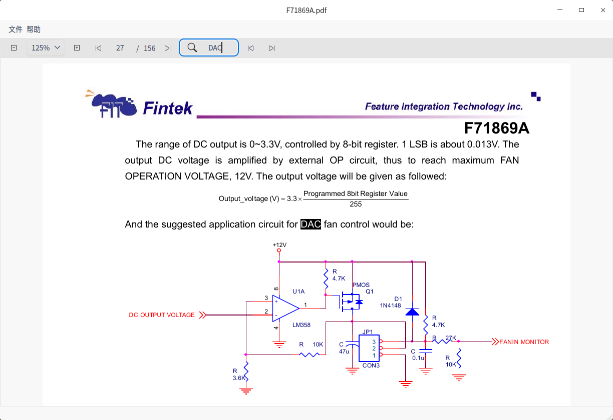

# 海天鹰PDF
Linux 平台基于 Qt5 和 poppler 的PDF查看器。

### 运行依赖：
libpoppler-qt5-1

### 编译依赖：
libpoppler-qt5-dev

### 参考
[API](https://poppler.freedesktop.org/api/qt5/index.html)
[在一个滚动布局显示所有页面](https://blog.csdn.net/yinyuchen1/article/details/77979965)
https://github.com/CryFeiFei/Reader
[缩放、搜索](https://doc.qt.io/archives/qq/qq27-poppler.html)